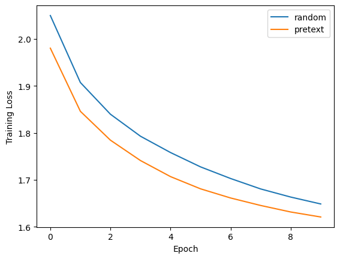

# 1st-grader-could-never

We're still figuring out how to use pencils

## Description

This is a project for the "Computer Vision" course at FEUP. The goal is two-fold:

- To train a neural network to colorize grayscale images.
- To investigate how colorazing images can be used to improve the performance of a neural network in a classification task.

## Neural Network

Our neural network is based on the [Colorful Image Colorization](https://arxiv.org/abs/1603.08511) paper. We downscaled the network to fit our needs, and we skipped the discretization step of the color space. We are, therefore, framing the colorization problem as a regression one, in contrast to the original paper, which framed it as a classification one.

For the classification task, we removed the decoder part of the network, and we added a fully connected layer with 2 neurons, followed by a softmax activation function. We use the CIFAR-10 dataset for training and testing.

## Results

As seen in the above graphic, the network is able to better classify images when it goes through the colorization training process.
